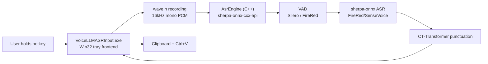
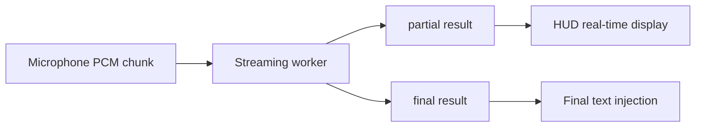

# Architecture

> 🇨🇳 [中文版](doc/ARCHITECTURE_zh.md)

This document describes the current implementation, not the final ideal design. For longer-term research plans, see `PLAN.md`.

## Overview



## Process

### `VoiceLLMASRInput.exe`

Single process. Responsibilities:

- Single instance enforcement.
- Register tray icon.
- Display Settings.
- Listen for global hotkeys.
- Capture microphone audio.
- Call sherpa-onnx C++ API directly via `AsrEngine` for VAD, ASR, and punctuation.
- Inject final text into the current application.

`AsrEngine` internally caches `OfflineRecognizer`, `VoiceActivityDetector`, and `OfflinePunctuation`. The same model is not loaded repeatedly.

## Source Code Structure

Since v0.6.0, the source code is organized into multiple modules:

| File | Responsibility |
|------|---------------|
| `src/globals.h` | Shared constants, control IDs, struct definitions, extern global variable declarations |
| `src/engine.h` / `src/engine.cpp` | Backend: string/path utilities, JSON config persistence, audio capture, `AsrEngine` class |
| `src/hud.h` / `src/hud.cpp` | HUD window, Direct2D/DirectWrite rendering, tray icon, UI resource creation/deletion |
| `src/hotkey.h` / `src/hotkey.cpp` | Hotkey config, CapsLock long-press logic, `WH_KEYBOARD_LL` hook, `HotkeyEdit` custom control |
| `src/settings.h` / `src/settings.cpp` | Settings window, tab UI, control creation, load/save, provider management, input dialog |
| `src/main.cpp` | Entry point (`wWinMain`), main window procedure, recording session orchestration, LLM refine |
| `src/llm_refine.h` | LLM correction module (header-only, `llm::` namespace) |
| `src/baidu_asr.h` | Baidu Cloud ASR module (header-only) |
| `src/volcengine_asr.h` | Volcengine (豆包) ASR module (header-only, WebSocket) |
| `src/firered_vad.h` | FireRed VAD module (header-only) |

Global variables are defined in `main.cpp` and accessed by other modules via `extern` declarations in `globals.h`.

## Main Modules

### Tray and Main Window

The main window is a hidden Win32 window used to receive tray messages, menu commands, and worker results.

Tray menu:

- `Settings...`
- `Reload ASR Worker`
- `Quit`

### Settings

Settings is a standard Win32 window with 4 tabs:

- `Recognition`: ASR Backend, model, model directory, threads, VAD, VAD model, Punctuation, hotkey config.
- `LLM`: Provider selection (Provider dropdown + [+] / [−]), API Base URL, API Key, Model, Test Connection, Debug log, Extra Params.
- `LLM Prompt`: System Prompt editor (multi-line), Basic Fix / Deep Fix preset buttons.
- `Cloud ASR`: Cloud provider selection, Baidu/Volcengine provider-specific fields.

When Settings is opened:

1. `UninstallKeyboardHook()` is called to pause global hotkey listening.
2. User can input `CapsLock` or other key combinations.
3. When the window is closed, `InstallKeyboardHook()` is called to restore listening.

The bottom `Status / Save / Close` is dynamically positioned by `LayoutSettingsWindow()` based on client area height to avoid clipping.

### Hotkey Listening

Uses `WH_KEYBOARD_LL`.

Normal hotkey behavior:

- `WM_KEYDOWN` / `WM_SYSKEYDOWN`: Start recording.
- `WM_KEYUP` / `WM_SYSKEYUP`: Stop recording and submit to ASR.
- Matches the configured main key and modifier keys.
- During recording, `g_activeHotkeyKey` is saved to avoid failure to stop when the main key is released after the modifier key.

`CapsLock` is a special default hotkey:

- When physical `CapsLock` is pressed, it is intercepted first without immediately triggering system Caps Lock toggle.
- Released within 300ms is considered a short press; the program sends a `CapsLock` event to let the system toggle normally.
- Held for more than 300ms is considered a long press; recording starts; upon release, recording stops and the Caps Lock state before pressing is restored.
- The injected `CapsLock` event is allowed to pass through the hook to avoid recursive interception.

### Recording

Currently uses `waveIn`:

- Sample rate: 16000
- Channels: mono
- Bit depth: 16-bit PCM
- Buffers: 4 buffers of approximately 100ms each

After recording stops, the audio is saved to:

```text
%APPDATA%\VoiceLLMASRInput\last_recording.wav
```

Recordings shorter than approximately 8000 bytes are judged as `Too short`.

### HUD

A borderless capsule HUD is displayed at the bottom center during recording. The current implementation uses Direct2D/DirectWrite:

- `WS_POPUP | WS_EX_TOOLWINDOW | WS_EX_TOPMOST | WS_EX_LAYERED` creates a floating window.
- Direct2D draws the capsule background, thin border, and 5 volume bars.
- DirectWrite draws status text, using DIP for measurement and layout.
- Win32 window size uses the current window DPI to convert DIP to physical pixels, avoiding text clipping on high DPI.
- The recording callback calculates PCM RMS for each `waveIn` buffer, normalizes it, and drives the volume bars.
- Volume bars use attack/release smoothing, redrawn via a ~33ms timer during recording.
- Currently displays `Listening...`, `Recognizing...`, final text, or error status; real partial text is not yet connected.

### VAD

When `Enable VAD` is turned on, voice detection is performed before ASR. The VAD model can be selected in Settings:

**Silero VAD** (default): sherpa-onnx's built-in `VoiceActivityDetector`, conservatively trims silence from the beginning and end.

**FireRed VAD**: An open-source DFSMN streaming VAD from the Xiaohongshu team, with higher accuracy (F1 97.57 vs 95.95, false alarm rate 2.69% vs 9.41%).

- `src/firered_vad.h` header-only module, uses `kaldi_native_fbank` for 80-dimensional fbank feature extraction + `onnxruntime` for model loading
- Model: `models/fireredvad_stream_vad_with_cache.onnx` (2.2MB)
- CMVN parameters: `models/cmvn.ark` (hardcoded in code)
- Streaming inference, updates DFSMN cache `[8, 1, 128, 19]` per frame
- **Critical**: Audio must be in int16 range (-32768~32767), normalized float must be multiplied by 32768

Current strategy (shared by both VADs):

- Only processes 16kHz audio.
- If no speech is detected, returns empty text directly without loading the ASR model.

### ASR Engine

`AsrEngine` class (in `src/engine.h` / `src/engine.cpp`) encapsulates the sherpa-onnx C++ API:

- `OfflineRecognizer`: ASR recognition (FireRedASR2 CTC/AED, SenseVoice)
- `VoiceActivityDetector`: Silero VAD
- `firered_vad::FireRedVad`: FireRed VAD (`src/firered_vad.h`)
- `OfflinePunctuation`: CT-Transformer punctuation

Models are cached after loading; the same configuration is not loaded repeatedly. When switching models or reloading, the cache is cleared and automatically reloaded on the next recognition.

Runtime DLL dependencies:
- `sherpa-onnx-cxx-api.dll`
- `sherpa-onnx-c-api.dll`
- `onnxruntime.dll`
- `kaldi-native-fbank-core.dll` (used by FireRed VAD)

### Model Adaptation

`AsrEngine` creates different recognizers based on `model_id`:

| model_id | Model | Files |
| --- | --- | --- |
| `firered_ctc` | FireRedASR2 CTC int8 | `model.int8.onnx`, `tokens.txt` |
| `firered_aed` | FireRedASR2 AED int8 | `encoder.int8.onnx`, `decoder.int8.onnx`, `tokens.txt` |
| `sensevoice` | SenseVoiceSmall int8 | `model.int8.onnx`, `tokens.txt` |

Currently only one ASR recognizer is cached. After switching models, the new model is loaded.

### Punctuation Post-processing

FireRedASR2 AED/CTC output often lacks punctuation, so the worker adds a local punctuation model:

```text
models/sherpa-onnx-punct-ct-transformer-zh-en-vocab272727-2024-04-12-int8/model.int8.onnx
```

Enabled when `Punctuation` is set to `Auto punctuate` or `Auto punctuate + LLM` in Settings. The `LLM` option calls a cloud LLM API for text correction (see LLM Correction Module).

### Text Injection

Current implementation:

1. Open clipboard.
2. Write `CF_UNICODETEXT`.
3. Send `Ctrl+V`.

Future improvements:

- Restore original clipboard after pasting.
- Fallback to Unicode `SendInput` when injection fails.
- Admin privilege window detection and prompting.

## Configuration

Configuration is saved to:

```text
<app-root>/config.json
```

Current structure is a flat JSON:

```json
{
  "model_id": "firered_aed",
  "model_dir": "D:\\...\\models\\sherpa-onnx-fire-red-asr2-zh_en-int8-2026-02-26",
  "threads": "4",
  "enable_vad": true,
  "vad_model": "silero",
  "enable_partial": true,
  "postprocess": "itn",
  "hotkey": "CapsLock",
  "llm_provider": "DeepSeek",
  "llm_providers_json": "{\"DeepSeek\":{\"endpoint\":\"https://api.deepseek.com\",\"api_key\":\"<encrypted>\",\"model\":\"deepseek-v4-flash\"}}",
  "llm_prompt": "",
  "enable_llm_debug": false
}
```

- `llm_provider`: Currently selected provider name.
- `llm_providers_json`: JSON string storing all providers' endpoint, api_key (DPAPI encrypted), and model.
- `llm_prompt`: Custom System Prompt (leave empty to use built-in default).
- `enable_llm_debug`: When enabled, records before/after ASR comparison to `log/llm_refine_YYYYMMDD.log`.

## Future Architecture Evolution

### True Streaming

Current approach is "record then recognize". To approach the experience of the macOS reference project, it needs to be changed to:



Possible approaches:

- Continue using offline models for simulated partial.
- Switch to/add streaming ASR models.
- Upgrade worker protocol to WebSocket or persistent binary stream.

### Conservative Correction

Cloud LLM correction has been integrated since v0.2.0 (`src/llm_refine.h`). Disabled by default; requires enabling in Settings by setting Punctuation to `Auto punctuate + LLM` and configuring the provider API Key.

Suggested future additions:

- User dictionary/terminology replacement.
- Chinese spelling correction model.

LLM must be disabled by default, and must include:

- Timeout.
- Change ratio limit.
- JSON output validation.
- Number, path, URL, code protection.
- Fall back to original ASR text on failure.

### Architecture Evolution

The current architecture is a pure C++ single-process design. Future considerations:

- Streaming ASR: Switch to models supporting `OnlineRecognizer` (e.g., Paraformer streaming, Zipformer2 CTC).
- WebSocket or persistent connection protocol for audio streaming.
- Rust/C++ independent service with thin UI frontend.

## Risk Points

- Win32 UI is prone to text clipping on high DPI; HUD uses DIP measurement and converts to physical pixels, Settings controls still need sufficient height.
- Model loading must always be in the worker, never blocking the UI thread.
- Models are large; memory usage needs real-world testing.
- Global hotkeys must not intercept user input when Settings is open.
- Clipboard injection may fail for some elevated privilege windows.
- Punctuation model can change sentence breaks but cannot correct ASR typos.
