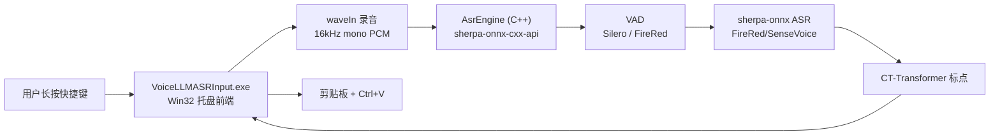
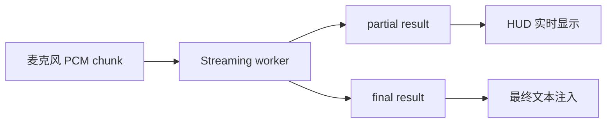

# 架构说明

本文描述当前实现，而不是最终理想设计。更长期的研究计划见 `PLAN.md`。

## 总览



## 进程

### `VoiceLLMASRInput.exe`

单进程。职责：

- 单实例运行。
- 注册托盘图标。
- 显示 Settings。
- 监听全局快捷键。
- 采集麦克风音频。
- 通过 `AsrEngine` 直接调用 sherpa-onnx C++ API 完成 VAD、ASR、标点。
- 将最终文本注入当前应用。

`AsrEngine` 内部缓存 `OfflineRecognizer`、`VoiceActivityDetector`、`OfflinePunctuation`，同一模型不会重复加载。

## 主要模块

### 托盘和主窗口

主窗口是隐藏 Win32 窗口，用来接收托盘消息、菜单命令和 worker 结果。

托盘菜单：

- `Settings...`
- `Reload ASR Worker`
- `Quit`

### Settings

Settings 是普通 Win32 窗口，目前分两个 tab：

- `Recognition`: 模型、模型目录、线程、VAD、Partial、Punctuation。
- `Shortcut`: 长按录音快捷键，默认 `CapsLock`。

打开 Settings 时：

1. 调用 `UninstallKeyboardHook()` 暂停全局快捷键监听。
2. 用户可以录入 `CapsLock` 或其他组合键。
3. 关闭窗口时调用 `InstallKeyboardHook()` 恢复监听。

底部 `Status / Save / Close` 由 `LayoutSettingsWindow()` 根据客户区高度动态定位，避免裁切。

### 快捷键监听

使用 `WH_KEYBOARD_LL`。

普通热键当前行为：

- `WM_KEYDOWN` / `WM_SYSKEYDOWN`: 开始录音。
- `WM_KEYUP` / `WM_SYSKEYUP`: 停止录音并提交 ASR。
- 匹配配置中的主键和修饰键。
- 录音期间保存 `g_activeHotkeyKey`，避免松开主键时因修饰键已释放导致无法停止。

`CapsLock` 是特殊默认热键：

- 物理 `CapsLock` 按下时先拦截，不立即触发系统大小写切换。
- 300ms 内松开视为短按，程序补发一次 `CapsLock`，让系统正常切换大小写。
- 按住超过 300ms 视为长按，开始录音；松开后停止录音并恢复按下前的 Caps Lock 状态。
- 补发的 `CapsLock` 注入事件会被 hook 放行，避免递归拦截。

### 录音

当前使用 `waveIn`：

- 采样率：16000
- 声道：mono
- 位深：16-bit PCM
- buffer：4 个约 100ms buffer

停止录音后写入：

```text
%APPDATA%\VoiceLLMASRInput\last_recording.wav
```

短于约 8000 bytes 的录音会被判定为 `Too short`。

### HUD

录音时显示底部居中的无边框胶囊 HUD。当前实现使用 Direct2D/DirectWrite：

- `WS_POPUP | WS_EX_TOOLWINDOW | WS_EX_TOPMOST | WS_EX_LAYERED` 创建悬浮窗。
- Direct2D 绘制胶囊背景、细边框和 5 根音量条。
- DirectWrite 绘制状态文本，并用 DIP 进行测量和布局。
- Win32 窗口尺寸使用当前窗口 DPI 将 DIP 转为物理像素，避免高 DPI 下文本裁切。
- 录音回调每个 `waveIn` buffer 计算 PCM RMS，归一化后驱动音量条。
- 音量条使用 attack/release 平滑，录音期间通过约 33ms 定时器重绘。
- 目前显示 `Listening...`、`Recognizing...`、最终文本或错误状态；真实 partial 文本尚未接入。

### VAD

`Enable VAD` 开启时，ASR 前先做人声检测。Settings 中可选择 VAD 模型：

**Silero VAD**（默认）：sherpa-onnx 内置的 `VoiceActivityDetector`，保守裁剪头尾静音。

**FireRed VAD**：小红书团队开源的 DFSMN 流式 VAD，准确率更高（F1 97.57 vs 95.95，误报率 2.69% vs 9.41%）。

- `firered_vad.h` header-only 模块，使用 `kaldi_native_fbank` 提取 80 维 fbank 特征 + `onnxruntime` 加载模型
- 模型：`models/fireredvad_stream_vad_with_cache.onnx`（2.2MB）
- CMVN 参数：`models/cmvn.ark`（硬编码进代码）
- 流式推理，每帧更新 DFSMN 缓存 `[8, 1, 128, 19]`
- **关键**：音频需要 int16 范围（-32768~32767），归一化 float 需先乘以 32768

当前策略（两种 VAD 共用）：

- 只处理 16kHz 音频。
- 没检测到语音时直接返回空文本，不加载 ASR 模型。

### ASR 引擎

`AsrEngine` 类（`main.cpp` 内部）封装 sherpa-onnx C++ API：

- `OfflineRecognizer`：ASR 识别（FireRedASR2 CTC/AED、SenseVoice）
- `VoiceActivityDetector`：Silero VAD
- `firered_vad::FireRedVad`：FireRed VAD（`firered_vad.h`）
- `OfflinePunctuation`：CT-Transformer 标点

模型加载后缓存，同一配置不会重复加载。切换模型或 Reload 时清除缓存，下次识别自动重新加载。

运行时 DLL 依赖：
- `sherpa-onnx-cxx-api.dll`
- `sherpa-onnx-c-api.dll`
- `onnxruntime.dll`
- `kaldi-native-fbank-core.dll`（FireRed VAD 使用）

### 模型适配

`asr_worker.py` 根据 `model_id` 创建不同 recognizer：

| model_id | 模型 | 文件 |
| --- | --- | --- |
| `firered_ctc` | FireRedASR2 CTC int8 | `model.int8.onnx`, `tokens.txt` |
| `firered_aed` | FireRedASR2 AED int8 | `encoder.int8.onnx`, `decoder.int8.onnx`, `tokens.txt` |
| `sensevoice` | SenseVoiceSmall int8 | `model.int8.onnx`, `tokens.txt` |

当前只缓存一个 ASR recognizer。切换模型后会加载新模型。

### 标点后处理

FireRedASR2 AED/CTC 输出常常没有标点，因此 worker 增加本地标点模型：

```text
models/sherpa-onnx-punct-ct-transformer-zh-en-vocab272727-2024-04-12-int8/model.int8.onnx
```

当 Settings 中 `Punctuation` 设为 `Auto punctuate` 或 `Auto punctuate + LLM` 时启用。当前 `LLM` 选项还没有真正接 LLM，只复用本地标点。

### 文本注入

当前实现：

1. 打开剪贴板。
2. 写入 `CF_UNICODETEXT`。
3. 发送 `Ctrl+V`。

后续可以补：

- 粘贴后恢复原剪贴板。
- 注入失败时 fallback 到 Unicode `SendInput`。
- 管理员权限窗口检测和提示。

## 配置

配置保存到：

```text
%APPDATA%\VoiceLLMASRInput\config.json
```

当前结构是扁平 JSON：

```json
{
  "model_id": "firered_aed",
  "model_dir": "D:\\...\\models\\sherpa-onnx-fire-red-asr2-zh_en-int8-2026-02-26",
  "threads": "4",
  "enable_vad": true,
  "vad_model": "silero",
  "enable_partial": true,
  "postprocess": "itn",
  "hotkey": "CapsLock"
}
```

`PLAN.md` 中有更完整的未来配置结构，但当前代码使用上面的 v1 扁平结构。

## 后续架构演进

### 真实流式

当前是“录完再识别”。要接近 macOS 参考项目的体验，需要改为：



可能路线：

- 继续用 offline 模型做模拟 partial。
- 更换/新增 streaming ASR 模型。
- worker 协议升级为 WebSocket 或长连接二进制流。

### 保守纠错

建议顺序：

1. 用户词库/术语替换。
2. 中文拼写纠错模型。
3. 可选本地小 LLM。

LLM 必须默认关闭，并加入：

- 超时。
- 改动比例限制。
- JSON 输出校验。
- 数字、路径、URL、代码保护。
- 失败直接使用 ASR 原文。

### 架构演进

当前已是纯 C++ 单进程架构。后续可考虑：

- 流式 ASR：更换支持 `OnlineRecognizer` 的模型（如 Paraformer 流式版、Zipformer2 CTC）。
- WebSocket 或长连接协议，支持音频流式传输。
- Rust/C++ 独立服务，前端保持薄 UI。

## 风险点

- Win32 UI 在高 DPI 下容易裁切文字；HUD 使用 DIP 测量并转物理像素，Settings 控件仍要留足高度。
- 模型加载必须永远在 worker 里，不能阻塞 UI 线程。
- 模型大，内存占用需要实测。
- 全局快捷键不能在 Settings 打开时拦截用户录入。
- 剪贴板注入对部分高权限窗口可能失败。
- 标点模型会改断句，但不能修正 ASR 错字。
