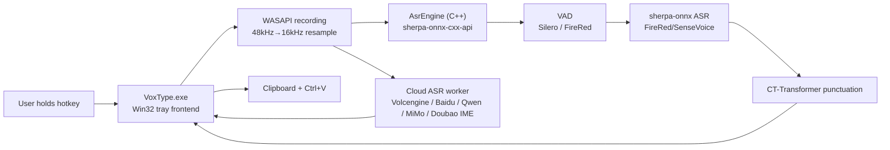
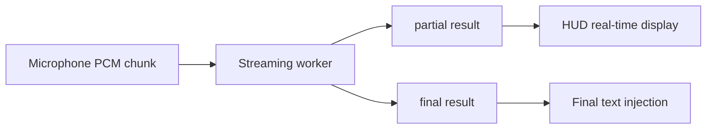

# Architecture

> 🇨🇳 [中文版](doc/ARCHITECTURE_zh.md)

This document describes the current implementation, not the final ideal design. For longer-term research plans, see `PLAN.md`.

## Overview



## Process

### `VoxType.exe`

Single process. Responsibilities:

- Single instance enforcement.
- Register tray icon.
- Display Settings.
- Listen for global hotkeys.
- Capture microphone audio.
- Call sherpa-onnx C++ API directly via `AsrEngine` for local VAD, ASR, and punctuation.
- Optionally route audio to cloud ASR backends: Baidu, Volcengine, Qwen ASR, MiMo ASR, or experimental Doubao IME ASR.
- Inject final text into the current application.

`AsrEngine` internally caches `OfflineRecognizer`, `VoiceActivityDetector`, and `OfflinePunctuation`. The same model is not loaded repeatedly.

## Source Code Structure

Since v0.6.0, the source code is organized into multiple modules. Current source files are grouped by area under `src/`:

| Directory | Responsibility |
|-----------|----------------|
| `src/app/` | Application entry point, global declarations, Win32 resources |
| `src/asr/` | ASR provider clients, batch/streaming sessions, ASR result dispatch helpers |
| `src/audio/` | Local ASR engine, audio capture, WASAPI, FireRed VAD, streaming VAD trim |
| `src/ui/` | HUD, hotkey handling, Settings window |
| `src/core/` | Shared utilities, LLM refine, input context reading |

| File | Responsibility |
|------|---------------|
| `src/app/globals.h` | Shared constants, control IDs, struct definitions, extern global variable declarations |
| `src/audio/engine.h` / `src/audio/engine.cpp` | Backend: string/path utilities, JSON config persistence, audio capture, `AsrEngine` class, `PreloadAsrEngine()` |
| `src/audio/streaming_vad_trimmer.h` / `src/audio/streaming_vad_trimmer.cpp` | Provider-independent streaming PCM VAD trim for cloud ASR sessions |
| `src/asr/asr_session.h` / `src/asr/asr_session.cpp` | Batch ASR session abstraction for Local, Baidu, MiMo, Qwen, and recorded Doubao IME paths |
| `src/asr/asr_result.h` / `src/asr/asr_result.cpp` | ASR text normalization, result/failure classification, and stable backend/result log names |
| `src/asr/asr_dispatcher.h` / `src/asr/asr_dispatcher.cpp` | Final ASR result dispatch, LLM gate, raw ASR tracking |
| `src/asr/asr_runtime_log.h` / `src/asr/asr_runtime_log.cpp` | Debug-only, privacy-safe ASR lifecycle logging with timestamp/PID and bounded rotation |
| `src/asr/cloud_asr_common.h` / `src/asr/cloud_asr_common.cpp` | Cloud replay buffer, adaptive finalize timeout, empty-final retry helpers |
| `src/ui/hud.h` / `src/ui/hud.cpp` | HUD window, Direct2D/DirectWrite rendering, tray icon, UI resource creation/deletion |
| `src/ui/hotkey.h` / `src/ui/hotkey.cpp` | Hotkey config, CapsLock long-press logic, `WH_KEYBOARD_LL` hook, `HotkeyEdit` custom control |
| `src/ui/settings.h` / `src/ui/settings.cpp` | Settings window, tab UI, control creation, load/save, provider management, input dialog |
| `src/app/main.cpp` | Entry point (`wWinMain`), main window procedure, recording session orchestration, LLM refine |
| `src/core/llm_refine.h` | LLM correction module (header-only, `llm::` namespace) |
| `src/asr/baidu_asr.h` | Baidu Cloud ASR module (header-only) |
| `src/asr/volcengine_asr.h` | Volcengine (豆包) ASR module (header-only, WebSocket) |
| `src/asr/qwen_asr.h` / `src/asr/qwen_asr.cpp` | Qwen ASR realtime WebSocket client |
| `src/asr/mimo_asr.h` / `src/asr/mimo_asr.cpp` | Xiaomi MiMo ASR batch client (`mimo-v2.5-asr`, WAV upload over `/chat/completions`) |
| `src/asr/doubao_ime_asr.h` / `src/asr/doubao_ime_asr.cpp` | Experimental Doubao IME client: device registration, token bootstrap, Opus encoding, and handwritten protobuf over WebSocket |
| `src/asr/doubao_ime_streaming_session.h` / `src/asr/doubao_ime_streaming_session.cpp` | Doubao IME `IStreamingAsrSession` wrapper with pending PCM buffer, replay retry, partial HUD, and credential writeback |
| `tools/doubao_ime_probe.bat` / `tools/doubao_ime_probe.cpp` | Standalone Doubao IME diagnostic probe: reuses saved credentials when available, runs a live protocol check, optionally runs a 16kHz mono WAV recognition check, and supports a real-time-ish streaming send/drain probe |
| `src/audio/firered_vad.h` | FireRed VAD module (header-only) |
| `src/core/input_context.h` | Input field context reading module (header-only, UIA/MSAA/WM_GETTEXT layered fallback) |
| `src/core/startup_registration.h` / `src/core/startup_registration.cpp` | Current-user Windows Run registration, including stale Portable-path detection and repair |
| `src/core/utils.h` | Shared utility functions (WideToUtf8, Utf8ToWide, EscapeJson, Trim) |

Global variables are defined in `main.cpp` and accessed by other modules via `extern` declarations in `globals.h`.

### Delay-Loaded DLLs

`onnxruntime.dll`, `sherpa-onnx-cxx-api.dll`, and `kaldi-native-fbank-core.dll` are delay-loaded via MSVC `/DELAYLOAD` linker flag. They are only loaded into memory when local ASR functions are actually called. In cloud-only mode, these DLLs are never loaded, keeping idle memory at ~12 MB.

`engine.cpp` includes `TryLoadAsrDlls()` which safely checks DLL availability before calling sherpa-onnx functions, returning `false` gracefully if DLLs are missing.

### Build, packaging, and mutable data

`CMakeLists.txt` and the `x64-release` CMake preset are the build authority.
`build.bat` prepares MSVC, invokes CMake/Ninja, then installs the only
supported runnable development payload at `build/run/x64-release`.

The generated `build/` root is deliberately small and validated:

```text
build/
├─ cmake/x64-release/   CMake/Ninja cache, objects, install manifest, package staging
├─ run/x64-release/     sole runnable development payload
├─ packages/            verified MSI and Portable assets, preserved by --clean
├─ artifacts/           generated package verification, test, and diagnostic reports
├─ logs/                explicit build/test logs
└─ README.txt           generated layout guide
```

Unexpected top-level items are reported by the layout validator rather than
silently being deleted or included in a package.

The Portable `.7z` and MSI both derive from that canonical runtime payload and
are independently extracted and compared with its hash manifest before being
placed in `build/packages`. The MSI is x64/per-machine, defaults to `Program
Files\VoxType`, and uses an Advanced folder picker. A stable HKLM
`Software\VoxType\InstallFolder` value is AppSearched before Major Upgrade so
the user-selected directory persists across releases.

Runtime assets remain alongside `VoxType.exe`. For an installed build,
configuration, downloaded models, punctuation models, and logs instead live
under `%LOCALAPPDATA%\VoxType`. A Portable payload has `portable.flag` and
keeps the same mutable data beside its executable. MSI never owns or removes
that mutable data.

### Model Preloading

When `asrBackend` is `local` and the model directory exists, `PreloadAsrEngine()` is called in a background thread at startup. This preloads the ASR model, VAD model (if enabled), and punctuation model (if enabled), eliminating first-press latency. After Settings Save, if the backend is `local`, models are reloaded and preloaded again. A `kPreloadDoneMessage` is posted to the main window to show an HUD notification.

## Main Modules

### Tray and Main Window

The main window is a hidden Win32 window used to receive tray messages, menu commands, and worker results.

Tray menu:

- `Settings...`
- `Reload ASR Worker`
- `Quit`

### Settings

Settings is a standard Win32 window with 5 tabs:

- `General`: recording hotkey and the optional current-user `HKCU\Software\Microsoft\Windows\CurrentVersion\Run\VoxType` startup registration.
- `Recognition`: ASR Backend, optional Fallback backend, model, model directory, threads, VAD, VAD model, and Punctuation.
- `LLM`: Provider selection (Provider dropdown + [+] / [−]), API Base URL, API Key, Model, Test Connection, Debug log, Extra Params.
- `LLM Prompt`: System Prompt editor (multi-line), Basic Fix / Deep Fix preset buttons.
- `Cloud ASR`: Cloud provider selection and Baidu/Volcengine/Qwen/MiMo/Doubao IME provider-specific fields.

When Settings is opened:

1. `UninstallKeyboardHook()` is called to pause global hotkey listening.
2. User can input `CapsLock` or other key combinations.
3. When the window is closed, `InstallKeyboardHook()` is called to restore listening.

The bottom `Status / Save / Close` is dynamically positioned by `LayoutSettingsWindow()` based on client area height to avoid clipping.

### Hotkey Listening

Uses `WH_KEYBOARD_LL`.

Normal hotkey behavior:

- `WM_KEYDOWN` / `WM_SYSKEYDOWN`: Start recording.
- `WM_KEYUP` / `WM_SYSKEYUP`: Stop recording and submit to ASR.
- Matches the configured main key and modifier keys.
- During recording, `g_activeHotkeyKey` is saved to avoid failure to stop when the main key is released after the modifier key.

`CapsLock` is a special default hotkey:

- When physical `CapsLock` is pressed, it is intercepted first without immediately triggering system Caps Lock toggle.
- Released within 300ms is considered a short press; the program sends a `CapsLock` event to let the system toggle normally.
- Held for more than 300ms is considered a long press; recording starts; upon release, recording stops and the Caps Lock state before pressing is restored.
- The injected `CapsLock` event is allowed to pass through the hook to avoid recursive interception.

### Recording

Currently uses WASAPI Shared Mode (since v0.7.3), with automatic fallback to `waveIn`:

- WASAPI: Captures at system mix format (typically 48kHz/32bit float/stereo), resamples to 16kHz/16bit/mono via linear interpolation
- waveIn fallback: 16kHz/16bit/mono, 4 buffers of approximately 100ms each

After recording stops, the audio is saved to:

```text
%APPDATA%\VoxType\last_recording.wav
```

Recordings shorter than approximately 8000 bytes are judged as `Too short`.

### HUD

A borderless capsule HUD is displayed at the bottom center during recording. The current implementation uses Direct2D/DirectWrite:

- `WS_POPUP | WS_EX_TOOLWINDOW | WS_EX_TOPMOST | WS_EX_LAYERED` creates a floating window.
- Direct2D draws the capsule background, thin border, and 5 volume bars.
- DirectWrite draws status text, using DIP for measurement and layout.
- Win32 window size uses the current window DPI to convert DIP to physical pixels, avoiding text clipping on high DPI.
- The recording callback calculates PCM RMS for each audio buffer, normalizes it, and drives the volume bars.
- Volume bars use attack/release smoothing, redrawn via a ~33ms timer during recording.
- Displays `Listening...`, `Recognizing...`, final text, or error status. Volcengine, Qwen ASR, and Doubao IME can post partial text to the HUD from their receive/drain threads.

### VAD

When `Enable VAD` is turned on, voice detection is performed before ASR. The VAD model can be selected in Settings:

**Silero VAD** (default): sherpa-onnx's built-in `VoiceActivityDetector`, conservatively trims silence from the beginning and end.

**FireRed VAD**: An open-source DFSMN streaming VAD from the Xiaohongshu team, with higher accuracy (F1 97.57 vs 95.95, false alarm rate 2.69% vs 9.41%).

- `src/audio/firered_vad.h` header-only module, uses `kaldi_native_fbank` for 80-dimensional fbank feature extraction + `onnxruntime` for model loading
- Model: `models/fireredvad_stream_vad_with_cache.onnx` (2.2MB)
- CMVN parameters: `models/cmvn.ark` (hardcoded in code)
- Streaming inference, updates DFSMN cache `[8, 1, 128, 19]` per frame
- **Critical**: Audio must be in int16 range (-32768~32767), normalized float must be multiplied by 32768

Current strategy (shared by both VADs):

- Only processes 16kHz audio.
- If no speech is detected, returns empty text directly without loading the ASR model.

### ASR Engine

`AsrEngine` class (in `src/audio/engine.h` / `src/audio/engine.cpp`) encapsulates the sherpa-onnx C++ API:

- `OfflineRecognizer`: ASR recognition (FireRedASR2 CTC/AED, SenseVoice)
- `VoiceActivityDetector`: Silero VAD
- `firered_vad::FireRedVad`: FireRed VAD (`src/audio/firered_vad.h`)
- `OfflinePunctuation`: CT-Transformer punctuation

Models are cached after loading; the same configuration is not loaded repeatedly. When switching models or reloading, the cache is cleared and automatically reloaded on the next recognition.

Runtime DLL dependencies:
- `sherpa-onnx-cxx-api.dll`
- `sherpa-onnx-c-api.dll`
- `onnxruntime.dll`
- `kaldi-native-fbank-core.dll` (used by FireRed VAD)

### Cloud ASR

Cloud backends are optional. Recognition runs remotely, and local punctuation is bypassed:

- **Baidu Cloud** uses a batch-style REST flow through `BaiduAsrSession`.
- **Volcengine** keeps its proven WebSocket protocol implementation in `src/asr/volcengine_asr.h`; `main.cpp` only wraps orchestration, replay retry, watchdog, and HUD dispatch around it.
- **Qwen ASR** uses DashScope `qwen3-asr-flash-realtime` through `src/asr/qwen_asr.h/.cpp`. The main recording path sends PCM chunks while recording, drains partial/final events on a separate thread, uses Manual turn detection (`turn_detection: null`), and sends `input_audio_buffer.commit` + `session.finish` after release.
- **MiMo ASR** uses Xiaomi MiMo `mimo-v2.5-asr` through `src/asr/mimo_asr.h/.cpp`. It is a batch cloud backend: captured 16k/16-bit/mono PCM is optionally VAD-trimmed, wrapped as WAV, base64 encoded as `data:audio/wav;base64,...`, and posted to `{baseUrl}/chat/completions`.
- **Doubao IME** uses the unofficial input-method endpoint `frontier-audio-ime-ws.doubao.com` through `src/asr/doubao_ime_asr.h/.cpp` and `src/asr/doubao_ime_streaming_session.cpp`. It is not the Volcengine official `openspeech.bytedance.com` protocol. The client registers a Doubao IME-style device, retrieves `asr_config.app_key`, encodes 20ms PCM frames with vendored static `libopus`, and sends handwritten protobuf messages (`StartTask`, `StartSession`, `TaskRequest`, `FinishSession`) over WinHTTP WebSocket. Credentials are written back to config on the main thread; token/auth failures clear credentials, transient startup failures retry while PCM keeps buffering, and abort closes active bootstrap/WebSocket handles to avoid blocking shutdown/watchdog paths. Because the IME service may emit cloud-side VAD final segments or clear/restart its partial text window during one hotkey hold, the streaming session tracks a committed prefix plus the active partial window and accumulates final text across WebSocket events; pre-`FinishSession` final events do not complete the post-stop wait. The HUD display is Doubao-specific and UI-only: partials are shown live while they fit within three body lines, then the HUD clears previous display text and restarts from the current last sentence; the cleared page accumulates normally until it exceeds three body lines again, and the full final paste text is unchanged.

Current verification status: the Doubao IME silent protocol probe, WAV recognition probe, and `--streaming` send/drain probe have passed against the live endpoint after the cross-event cloud-VAD accumulation fix; `.\build.bat` and `git diff --check` have passed, with only existing CRLF warnings from `git diff --check`. Tray-level manual long-recording retest, network interruption/watchdog recovery, and additional DPI passes still need manual smoke testing.

When `Enable VAD` is on, Qwen and Volcengine streaming backends run audio through `StreamingVadTrimmer` before upload, while batch cloud backends use `BatchVadTrimmer` after recording and before the request. Doubao IME intentionally bypasses local VAD and uploads raw PCM encoded as Opus. The local VAD paths share `VadTrimCore`, trimming head/tail silence while preserving middle pauses. Common cloud behavior such as replay buffer, adaptive finalize timeout, empty final retry, and result classification is shared through `cloud_asr_common.*` and `asr_result.*` where applicable.

### ASR Fallback Orchestration and Diagnostics

Fallback is serial: the primary backend completes its own retry/replay policy first, and only a final `OperationalError` can start the configured fallback with the same raw 16kHz/s16le/mono PCM. `Too short`, `No speech detected`, cancellation, stale attempts, a disabled/same-as-primary fallback, and usable primary text never trigger fallback. Volcengine is supported as a primary backend but is intentionally not offered as a fallback target; Local, Baidu, Qwen, MiMo, and recorded Doubao IME are valid fallback targets.

`main.cpp` owns a monotonically increasing recognition-attempt context containing the primary config, recording/final state, raw PCM, and fallback claim. Streaming callbacks only post a main-window message. If a streaming provider exhausts retries and posts a final failure before the hotkey is released, that final is retained in the attempt context; release stores the complete PCM, applies too-short/VAD no-speech gates, and then resumes the same completion path. This prevents early provider failure from either running fallback on partial audio or bypassing fallback because PCM was not yet available. Watchdog and provider callbacks race through one final-claim guard, and fallback workers recheck the attempt id before side effects and dispatch.

With fallback enabled, the post-release primary streaming final budget remains adaptive at 6–12 seconds; provider-internal batch/recorded request budgets remain separate and longer. v0.9.7 does not change those retry or timeout formulas.

Debug Mode writes two bounded files under `%TEMP%`:

- `voxtype_asr_runtime.log`: structured attempt/primary/fallback lifecycle events. It records backend ids, normalized result/failure classes, source, elapsed time, recording duration, and PCM sizes, never transcript text or raw provider errors.
- `volc_asr_debug.log`: privacy-redacted Volcengine transport/retry diagnostics. Request JSON, response payloads, transcripts, raw provider errors, and proxy-address strings are not persisted.

Both logs include full local date/time with milliseconds and PID, rotate at 5 MiB, and retain `.1` and `.2` archives. No file is written while Debug Mode is disabled. Rotation does not proactively delete an older pre-v0.9.7 log; new writes are sanitized and normal size rotation eventually archives/replaces it.

### Model Adaptation

`AsrEngine` creates different recognizers based on `model_id`:

| model_id | Model | Files |
| --- | --- | --- |
| `firered_ctc` | FireRedASR2 CTC int8 | `model.int8.onnx`, `tokens.txt` |
| `firered_aed` | FireRedASR2 AED int8 | `encoder.int8.onnx`, `decoder.int8.onnx`, `tokens.txt` |
| `sensevoice` | SenseVoiceSmall int8 | `model.int8.onnx`, `tokens.txt` |

Currently only one ASR recognizer is cached. After switching models, the new model is loaded.

### Punctuation Post-processing

FireRedASR2 AED/CTC output often lacks punctuation, so the worker adds a local punctuation model:

```text
models/sherpa-onnx-punct-ct-transformer-zh-en-vocab272727-2024-04-12-int8/model.int8.onnx
```

Enabled when `Punctuation` is set to `Auto punctuate` or `Auto punctuate + LLM` in Settings. The `LLM` option calls a cloud LLM API for text correction (see LLM Correction Module).

### Text Injection

Current implementation (`PasteTextImeAware`):

1. **WeChat** (`Weixin.exe`): `WM_CHAR` character-by-character sending (WeChat's custom Qt controls intercept Ctrl+V)
2. **Other applications**: Clipboard + `Ctrl+V` + IMM32 temporary English mode switch
3. **Force Unicode Input** (optional): `SendInput` + `KEYEVENTF_UNICODE` character-by-character sending
4. All paths use `SendMessageTimeoutW` + `SMTO_ABORTIFHUNG` + 2-second timeout, preventing UI thread blocking if target window hangs

## Configuration

Installed-build configuration is saved to:

```text
%LOCALAPPDATA%\VoxType\config.json
```

Downloaded ASR/punctuation models and logs use sibling `models` and `log`
directories under the same mutable-data root. A Portable build is identified by
`<app-root>\portable.flag` and uses `<app-root>\config.json` plus its adjacent
`models` and `log` directories instead.

Current structure is a flat JSON:

```json
{
  "model_id": "firered_aed",
  "model_dir": "D:\\...\\models\\sherpa-onnx-fire-red-asr2-zh_en-int8-2026-02-26",
  "threads": "4",
  "enable_vad": true,
  "vad_model": "silero",
  "enable_partial": true,
  "postprocess": "itn",
  "hotkey": "CapsLock",
  "llm_provider": "DeepSeek",
  "llm_providers_json": "{\"DeepSeek\":{\"endpoint\":\"https://api.deepseek.com\",\"api_key\":\"<encrypted>\",\"model\":\"deepseek-v4-flash\"}}",
  "llm_prompt": "",
  "enable_llm_debug": false,
  "asr_backend": "doubao_ime",
  "fallback_asr_backend": "local",
  "cloud_provider": "doubao_ime",
  "qwen_base_url": "wss://dashscope.aliyuncs.com/api-ws/v1/realtime",
  "qwen_model": "qwen3-asr-flash-realtime",
  "qwen_language": "",
  "qwen_chunk_ms": 100,
  "mimo_base_url": "https://token-plan-ams.xiaomimimo.com/v1",
  "mimo_model": "mimo-v2.5-asr",
  "mimo_language": "auto",
  "doubao_ime_device_id": "<device_id>",
  "doubao_ime_cdid": "<cdid>",
  "doubao_ime_token": "<encrypted>"
}
```

- `llm_provider`: Currently selected provider name.
- `llm_providers_json`: JSON string storing all providers' endpoint, api_key (DPAPI encrypted), and model.
- `llm_prompt`: Custom System Prompt (leave empty to use built-in default).
- `enable_llm_debug`: When enabled, records before/after ASR comparison to `log/llm_refine_YYYYMMDD.log`.
- `asr_backend`: Active ASR backend (`local`, `baidu`, `volcengine`, `qwen`, `mimo`, or `doubao_ime`).
- `fallback_asr_backend`: Optional serial fallback (`none`, `local`, `baidu`, `qwen`, `mimo`, or `doubao_ime`); it must differ from `asr_backend`. Volcengine is not a fallback target.
- `qwen_*`: Qwen ASR connection/model/language/chunk settings. Turn detection is fixed to Manual and is not persisted.
- `mimo_*`: Xiaomi MiMo ASR API key, OpenAI-compatible Base URL, model, and language (`auto`, `zh`, `en`). The API key is DPAPI-encrypted in `mimo_api_key`.
- `doubao_ime_*`: Experimental Doubao IME device id, cdid, and DPAPI-encrypted token. These are auto-registered and can be reset from Settings.

## Future Architecture Evolution

### Streaming Evolution

Qwen, Volcengine, and Doubao IME already support cloud partial HUD while recording. Local ASR, Baidu, and MiMo still use a record-then-finalize flow. The future direction is to make streaming capability a first-class session trait instead of keeping provider-specific orchestration in `main.cpp`:



Possible approaches:

- Continue using offline models for simulated local partial.
- Switch to/add streaming local ASR models.
- Introduce a `StreamingAsrSession` interface for cloud providers so Qwen/Volcengine orchestration can move out of `main.cpp`.

### Conservative Correction

Cloud LLM correction has been integrated since v0.2.0 (`src/core/llm_refine.h`). Disabled by default; requires enabling in Settings by setting Punctuation to `Auto punctuate + LLM` and configuring the provider API Key.

Suggested future additions:

- User dictionary/terminology replacement.
- Chinese spelling correction model.

LLM must be disabled by default, and must include:

- Timeout.
- Change ratio limit.
- JSON output validation.
- Number, path, URL, code protection.
- Fall back to original ASR text on failure.

### Architecture Evolution

The current architecture is a pure C++ single-process design. Future considerations:

- Streaming ASR: Switch to models supporting `OnlineRecognizer` (e.g., Paraformer streaming, Zipformer2 CTC).
- WebSocket or persistent connection protocol for audio streaming.
- Rust/C++ independent service with thin UI frontend.

## Risk Points

- Win32 UI is prone to text clipping on high DPI; HUD uses DIP measurement and converts to physical pixels, Settings controls still need sufficient height.
- Model loading must always be in the worker, never blocking the UI thread.
- Models are large; memory usage needs real-world testing.
- Global hotkeys must not intercept user input when Settings is open.
- Clipboard injection may fail for some elevated privilege windows.
- Punctuation model can change sentence breaks but cannot correct ASR typos.
