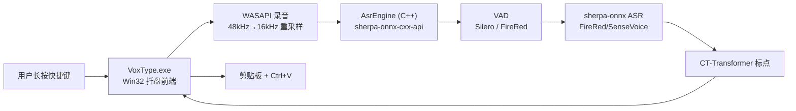
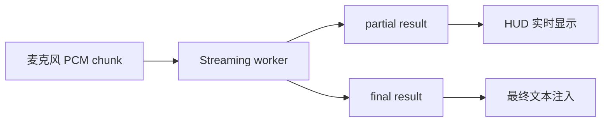

# 架构说明

> 🇬🇧 [English](../ARCHITECTURE.md)

本文描述当前实现，而不是最终理想设计。更长期的研究计划见 `PLAN.md`。

## 总览



## 进程

### `VoxType.exe`

单进程。职责：

- 单实例运行。
- 注册托盘图标。
- 显示 Settings。
- 监听全局快捷键。
- 采集麦克风音频。
- 通过 `AsrEngine` 直接调用 sherpa-onnx C++ API 完成 VAD、ASR、标点。
- 将最终文本注入当前应用。

`AsrEngine` 内部缓存 `OfflineRecognizer`、`VoiceActivityDetector`、`OfflinePunctuation`，同一模型不会重复加载。

## 源码结构

自 v0.6.0 起，源码组织为多个模块：

| 文件 | 职责 |
|------|------|
| `src/globals.h` | 共享常量、控件 ID、结构体定义、extern 全局变量声明 |
| `src/engine.h` / `src/engine.cpp` | 后端：字符串/路径工具、JSON 配置持久化、音频采集、`AsrEngine` 类、`PreloadAsrEngine()` |
| `src/hud.h` / `src/hud.cpp` | HUD 窗口、Direct2D/DirectWrite 渲染、托盘图标、UI 资源创建/销毁 |
| `src/hotkey.h` / `src/hotkey.cpp` | 热键配置、CapsLock 长按逻辑、`WH_KEYBOARD_LL` Hook、`HotkeyEdit` 自绘控件 |
| `src/settings.h` / `src/settings.cpp` | Settings 窗口、tab UI、控件创建、加载/保存、Provider 管理、输入对话框 |
| `src/main.cpp` | 入口（`wWinMain`）、主窗口过程、录音会话编排、LLM 纠错 |
| `src/llm_refine.h` | LLM 纠错模块（header-only，`llm::` 命名空间） |
| `src/baidu_asr.h` | 百度智能云 ASR 模块（header-only） |
| `src/volcengine_asr.h` | 火山引擎（豆包）ASR 模块（header-only，WebSocket） |
| `src/firered_vad.h` | FireRed VAD 模块（header-only） |
| `src/input_context.h` | 输入框上下文读取模块（header-only，UIA/MSAA/WM_GETTEXT 分层 Fallback） |
| `src/utils.h` | 共享工具函数（WideToUtf8、Utf8ToWide、EscapeJson、Trim） |

全局变量在 `main.cpp` 中定义，其他模块通过 `globals.h` 的 `extern` 声明引用。

### 延迟加载 DLL

`onnxruntime.dll`、`sherpa-onnx-cxx-api.dll`、`kaldi-native-fbank-core.dll` 通过 MSVC `/DELAYLOAD` 链接选项延迟加载。只在本地 ASR 函数实际调用时才加载到内存。纯云端模式下这些 DLL 永远不会加载，空闲内存保持在 ~12 MB。

`engine.cpp` 中的 `TryLoadAsrDlls()` 安全检查 DLL 是否可用，缺失时优雅返回 false。

### 模型预加载

当 `asrBackend` 为 `local` 且模型目录存在时，启动时 `PreloadAsrEngine()` 在后台线程预加载当前模型（ASR + VAD + 标点），消除首次按热键的延迟。Settings Save 后如果后端为 `local`，会 Reload + 后台预加载新模型。预加载完成后发送 `kPreloadDoneMessage`，HUD 显示 "ASR ready: xxx"。

## 主要模块

### 托盘和主窗口

主窗口是隐藏 Win32 窗口，用来接收托盘消息、菜单命令和 worker 结果。

托盘菜单：

- `Settings...`
- `Reload ASR Worker`
- `Quit`

### Settings

Settings 是普通 Win32 窗口，目前分 4 个 tab：

- `Recognition`: ASR Backend、模型、模型目录、线程、VAD、VAD 模型、Punctuation、快捷键配置。
- `LLM`: 供应商选择（Provider dropdown + [+] / [−]）、API Base URL、API Key、Model、Test Connection、Debug log、Extra Params。
- `LLM Prompt`: System Prompt 编辑（多行）、Basic Fix / Deep Fix 预设按钮。
- `Cloud ASR`: 云端供应商选择、百度/火山引擎专属字段。

打开 Settings 时：

1. 调用 `UninstallKeyboardHook()` 暂停全局快捷键监听。
2. 用户可以录入 `CapsLock` 或其他组合键。
3. 关闭窗口时调用 `InstallKeyboardHook()` 恢复监听。

底部 `Status / Save / Close` 由 `LayoutSettingsWindow()` 根据客户区高度动态定位，避免裁切。

### 快捷键监听

使用 `WH_KEYBOARD_LL`。

普通热键当前行为：

- `WM_KEYDOWN` / `WM_SYSKEYDOWN`: 开始录音。
- `WM_KEYUP` / `WM_SYSKEYUP`: 停止录音并提交 ASR。
- 匹配配置中的主键和修饰键。
- 录音期间保存 `g_activeHotkeyKey`，避免松开主键时因修饰键已释放导致无法停止。

`CapsLock` 是特殊默认热键：

- 物理 `CapsLock` 按下时先拦截，不立即触发系统大小写切换。
- 300ms 内松开视为短按，程序补发一次 `CapsLock`，让系统正常切换大小写。
- 按住超过 300ms 视为长按，开始录音；松开后停止录音并恢复按下前的 Caps Lock 状态。
- 补发的 `CapsLock` 注入事件会被 hook 放行，避免递归拦截。

### 录音

当前使用 WASAPI Shared Mode（v0.7.3 起），自动 fallback 到 `waveIn`：

- WASAPI：以系统混合格式（通常 48kHz/32bit float/立体声）捕获，通过线性插值重采样到 16kHz/16bit/单声道
- waveIn fallback：16kHz/16bit/单声道，4 个约 100ms buffer

停止录音后写入：

```text
%APPDATA%\VoxType\last_recording.wav
```

短于约 8000 bytes 的录音会被判定为 `Too short`。

### HUD

录音时显示底部居中的无边框胶囊 HUD。当前实现使用 Direct2D/DirectWrite：

- `WS_POPUP | WS_EX_TOOLWINDOW | WS_EX_TOPMOST | WS_EX_LAYERED` 创建悬浮窗。
- Direct2D 绘制胶囊背景、细边框和 5 根音量条。
- DirectWrite 绘制状态文本，并用 DIP 进行测量和布局。
- Win32 窗口尺寸使用当前窗口 DPI 将 DIP 转为物理像素，避免高 DPI 下文本裁切。
- 录音回调计算每个音频 buffer 的 PCM RMS，归一化后驱动音量条。
- 音量条使用 attack/release 平滑，录音期间通过约 33ms 定时器重绘。
- 目前显示 `Listening...`、`Recognizing...`、最终文本或错误状态；真实 partial 文本尚未接入。

### VAD

`Enable VAD` 开启时，ASR 前先做人声检测。Settings 中可选择 VAD 模型：

**Silero VAD**（默认）：sherpa-onnx 内置的 `VoiceActivityDetector`，保守裁剪头尾静音。

**FireRed VAD**：小红书团队开源的 DFSMN 流式 VAD，准确率更高（F1 97.57 vs 95.95，误报率 2.69% vs 9.41%）。

- `src/firered_vad.h` header-only 模块，使用 `kaldi_native_fbank` 提取 80 维 fbank 特征 + `onnxruntime` 加载模型
- 模型：`models/fireredvad_stream_vad_with_cache.onnx`（2.2MB）
- CMVN 参数：`models/cmvn.ark`（硬编码进代码）
- 流式推理，每帧更新 DFSMN 缓存 `[8, 1, 128, 19]`
- **关键**：音频需要 int16 范围（-32768~32767），归一化 float 需先乘以 32768

当前策略（两种 VAD 共用）：

- 只处理 16kHz 音频。
- 没检测到语音时直接返回空文本，不加载 ASR 模型。

### ASR 引擎

`AsrEngine` 类（`src/engine.h` / `src/engine.cpp`）封装 sherpa-onnx C++ API：

- `OfflineRecognizer`：ASR 识别（FireRedASR2 CTC/AED、SenseVoice）
- `VoiceActivityDetector`：Silero VAD
- `firered_vad::FireRedVad`：FireRed VAD（`src/firered_vad.h`）
- `OfflinePunctuation`：CT-Transformer 标点

模型加载后缓存，同一配置不会重复加载。切换模型或 Reload 时清除缓存，下次识别自动重新加载。

运行时 DLL 依赖：
- `sherpa-onnx-cxx-api.dll`
- `sherpa-onnx-c-api.dll`
- `onnxruntime.dll`
- `kaldi-native-fbank-core.dll`（FireRed VAD 使用）

### 模型适配

`AsrEngine` 根据 `model_id` 创建不同 recognizer：

| model_id | 模型 | 文件 |
| --- | --- | --- |
| `firered_ctc` | FireRedASR2 CTC int8 | `model.int8.onnx`, `tokens.txt` |
| `firered_aed` | FireRedASR2 AED int8 | `encoder.int8.onnx`, `decoder.int8.onnx`, `tokens.txt` |
| `sensevoice` | SenseVoiceSmall int8 | `model.int8.onnx`, `tokens.txt` |

当前只缓存一个 ASR recognizer。切换模型后会加载新模型。

### 标点后处理

FireRedASR2 AED/CTC 输出常常没有标点，因此 worker 增加本地标点模型：

```text
models/sherpa-onnx-punct-ct-transformer-zh-en-vocab272727-2024-04-12-int8/model.int8.onnx
```

当 Settings 中 `Punctuation` 设为 `Auto punctuate` 或 `Auto punctuate + LLM` 时启用。`LLM` 选项会调用云端 LLM API 进行文本纠错（见 LLM 纠错模块）。

### 文本注入

当前实现（`PasteTextImeAware`）：

1. **微信**（`Weixin.exe`）：`WM_CHAR` 逐字符发送（微信自定义 Qt 控件拦截 Ctrl+V）
2. **其他应用**：剪贴板 + `Ctrl+V` + IMM32 临时切换英文模式
3. **Force Unicode Input**（可选）：`SendInput` + `KEYEVENTF_UNICODE` 逐字符发送
4. 所有路径使用 `SendMessageTimeoutW` + `SMTO_ABORTIFHUNG` + 2 秒超时，防止目标窗口挂起阻塞 UI

## 配置

配置保存到：

```text
<app-root>/config.json
```

当前结构是扁平 JSON：

```json
{
  "model_id": "firered_aed",
  "model_dir": "D:\\...\\models\\sherpa-onnx-fire-red-asr2-zh_en-int8-2026-02-26",
  "threads": "4",
  "enable_vad": true,
  "vad_model": "silero",
  "enable_partial": true,
  "postprocess": "itn",
  "hotkey": "CapsLock",
  "llm_provider": "DeepSeek",
  "llm_providers_json": "{\"DeepSeek\":{\"endpoint\":\"https://api.deepseek.com\",\"api_key\":\"<encrypted>\",\"model\":\"deepseek-v4-flash\"}}",
  "llm_prompt": "",
  "enable_llm_debug": false
}
```

- `llm_provider`：当前选中的供应商名称。
- `llm_providers_json`：JSON 字符串，存储所有供应商的 endpoint、api_key（DPAPI 加密）、model。
- `llm_prompt`：自定义 System Prompt（留空使用内置默认）。
- `enable_llm_debug`：开启后记录 ASR 前后对比到 `log/llm_refine_YYYYMMDD.log`。

## 后续架构演进

### 真实流式

当前是“录完再识别”。要接近 macOS 参考项目的体验，需要改为：



可能路线：

- 继续用 offline 模型做模拟 partial。
- 更换/新增 streaming ASR 模型。
- worker 协议升级为 WebSocket 或长连接二进制流。

### 保守纠错

v0.2.0 起已接入云端 LLM 纠错（`src/llm_refine.h`）。默认关闭，需在 Settings 中将 Punctuation 设为 `Auto punctuate + LLM` 并配置供应商 API Key。

建议后续补充：

- 用户词库/术语替换。
- 中文拼写纠错模型。

LLM 必须默认关闭，并加入：

- 超时。
- 改动比例限制。
- JSON 输出校验。
- 数字、路径、URL、代码保护。
- 失败直接使用 ASR 原文。

### 架构演进

当前已是纯 C++ 单进程架构。后续可考虑：

- 流式 ASR：更换支持 `OnlineRecognizer` 的模型（如 Paraformer 流式版、Zipformer2 CTC）。
- WebSocket 或长连接协议，支持音频流式传输。
- Rust/C++ 独立服务，前端保持薄 UI。

## 风险点

- Win32 UI 在高 DPI 下容易裁切文字；HUD 使用 DIP 测量并转物理像素，Settings 控件仍要留足高度。
- 模型加载必须永远在 worker 里，不能阻塞 UI 线程。
- 模型大，内存占用需要实测。
- 全局快捷键不能在 Settings 打开时拦截用户录入。
- 剪贴板注入对部分高权限窗口可能失败。
- 标点模型会改断句，但不能修正 ASR 错字。
